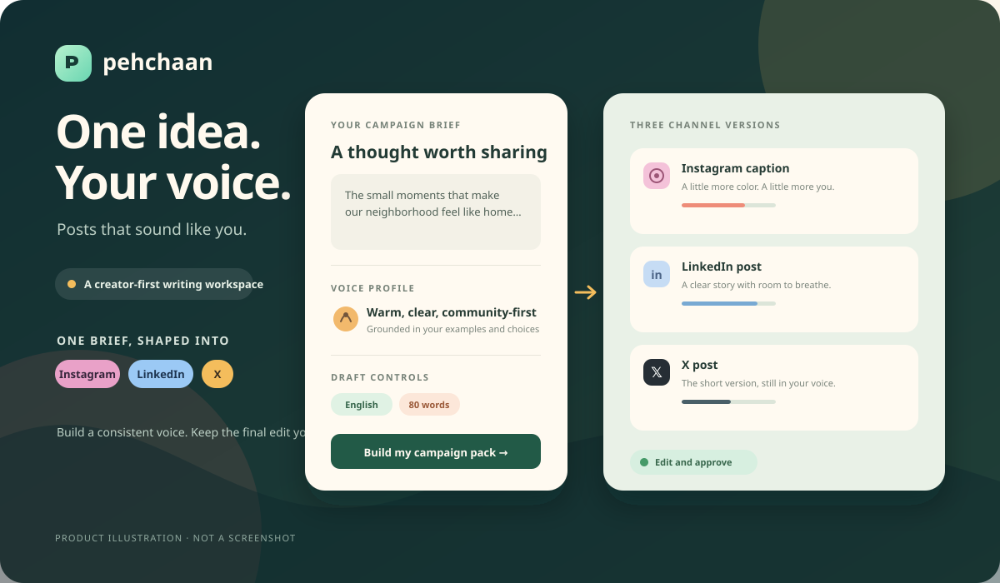
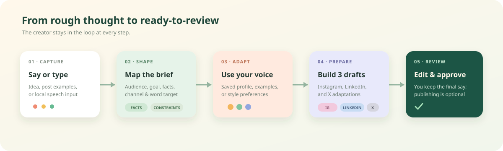
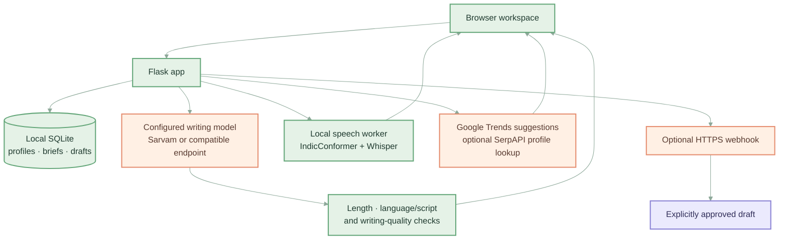

<div align="center">
  

  <h1>Pehchaan</h1>
  <h3>Posts that sound like you.</h3>
  <p>Turn one rough thought into thoughtful, editable social drafts—shaped by your voice, audience, and channel.</p>

  <a href="#quickstart">Run locally</a> · <a href="#the-90-second-demo">See the demo path</a> · <a href="#how-it-works">How it works</a>
  <br /><br />
  
  
  
  
</div>

---

## The pitch

Creators do not need another blank prompt box. They need a repeatable way to turn what they mean into posts that still sound like them—without rewriting the same idea for every platform.

**Pehchaan is a creator-first writing workspace:** bring an idea, a few authored examples, or a voice description; shape a concise campaign brief; then review platform-specific drafts before anything is published.

> **One idea. Your voice. Three channels. You keep the final edit.**

## The product, at a glance



### Why creators reach for it

- **A voice that has context:** build a reusable profile from selected authored posts or your own style notes. Each post stays its own example instead of becoming one blended template.
- **One brief, three adaptations:** generate and edit an Instagram caption, LinkedIn post, and X post from the same idea.
- **More control than “make it better”:** set audience, goal, approved facts, writing rules, language, tone, and length. See word counts and platform limits as you work.
- **Made for multilingual creators:** choose English, Hindi, Kannada, Hinglish, or Kanglish. Hindi and Kannada speech input uses local IndicConformer first, with local Whisper fallback; English uses local Whisper.
- **Useful discovery, without reach promises:** explore Google Trends related searches as optional context. The writing-quality rubric is directional; it does not predict reach or engagement.
- **Human approval stays in the loop:** every publish request is gated by approval of the saved draft.

## How it works

```mermaid
%%{init: {"theme":"base","themeVariables":{"primaryColor":"#e5f2e7","primaryTextColor":"#203b30","primaryBorderColor":"#5c9b72","lineColor":"#799e85","secondaryColor":"#fff0e4","tertiaryColor":"#ebeafd","fontFamily":"Arial"}}}%%
flowchart LR
    A[💡 Idea, authored posts<br/>or voice notes] --> B[🧭 Shape the brief<br/>audience · goal · facts]
    B --> C[🪪 Apply a saved voice<br/>or style preferences]
    C --> D[✍️ Generate and refine<br/>language · length · channel]
    D --> E[📦 Instagram + LinkedIn + X]
    E --> F[👀 Edit, review, approve]
    F --> G[🚀 Optional configured<br/>publishing workflow]
    classDef idea fill:#fff0e4,stroke:#e58e70,color:#593b31,stroke-width:2px
    classDef brief fill:#e5f2e7,stroke:#65a77a,color:#203b30,stroke-width:2px
    classDef voice fill:#fff4d6,stroke:#d4a847,color:#594620,stroke-width:2px
    classDef draft fill:#ebeafd,stroke:#8a82d4,color:#302d58,stroke-width:2px
    classDef publish fill:#dff1ed,stroke:#4aa68d,color:#174a3f,stroke-width:2px
    class A idea
    class B brief
    class C voice
    class D,E draft
    class F,G publish
```



### Under the hood



## Pehchaan vs a general-purpose VLM

A general-purpose model can write social posts—and, with the right context, follow a voice guide or return several platform versions. ChatGPT also offers Custom Instructions and Projects for reusable guidance and context ([Custom Instructions](https://help.openai.com/en/articles/8096356-chatgpt-custom-instructions), [Projects](https://help.openai.com/en/articles/10169521-projects-in-chatgpt)). **Pehchaan does not claim that a general model cannot do the writing. It packages the repeatable creator workflow as the product.**

| Workflow moment | General-purpose VLM (for example, ChatGPT) | Pehchaan |
|---|---|---|
| Start a campaign | Explain the task in a prompt; add relevant files or context | Guided brief for idea, audience, goal, facts, voice, language, and length |
| Reuse a voice | Provide a voice guide, examples, or configured instructions/context | Save and select a voice profile built from posts or style preferences |
| Adapt across channels | Ask for each channel and its constraints | Build an editable Instagram + LinkedIn + X pack from one brief |
| Keep constraints visible | Include them in the prompt and review the result | Word target, platform limits, approved facts, and writing rules are first-class controls |
| Work with Indian languages | Prompt for the desired language and script | Explicit language choices plus a local Hindi/Kannada speech-transcription path |
| Decide what goes live | Copy the answer into a publishing workflow | Review and explicitly approve the saved draft; optional webhook publishing |

**Fair-comparison note:** this compares default workflow shape, not raw model quality. Both approaches need human review, and output depends on the chosen model, prompt, and configuration.

## The 90-second demo

1. **Say or type a real post idea.** Pick the language for the draft.
2. **Add context that changes the writing.** Choose a saved voice, specify an audience, or add verified facts and rules.
3. **Set the target.** Choose a platform and length; see the actual word count and channel limit.
4. **Build the pack.** Generate Instagram, LinkedIn, and X versions from the same brief.
5. **Make it yours.** Edit the copy, inspect the quality rubric, then approve the saved text if publishing is configured.

## Built with

| Layer | What it does |
|---|---|
| HTML, CSS, vanilla JavaScript | Responsive workspace, onboarding, brief controls, draft editor, and campaign pack |
| Python + Flask | Generation, voice profiles, discovery, transcription routing, draft storage, and approval |
| SQLite | Local storage for profiles, campaigns, drafts, and optional provider-reported observations |
| Sarvam or compatible chat-completions API | Draft generation when configured; model credentials stay server-side |
| KrishiDisha local STT | IndicConformer-first Hindi/Kannada transcription with quality checks and local Whisper fallback |
| Google Trends / optional SerpAPI | Related-search discovery and optional Instagram profile-post lookup |
| Optional HTTPS webhook | Sends `text` and `prompt` query parameters after explicit approval |

## Quickstart

### 1. Install and run

Requires Python 3.10 or later.

```bash
git clone https://github.com/Anvation-CSE-2026/ANV26-AI-41_Pehchaan.git
cd ANV26-AI-41_Pehchaan
python -m venv .venv
```

Activate the environment and install dependencies:

```powershell
# Windows PowerShell
.\.venv\Scripts\Activate.ps1
pip install -r requirements.txt
```

```bash
# macOS / Linux
source .venv/bin/activate
pip install -r requirements.txt
```

Copy `.env.example` to `.env`, configure only the integrations you want, then start the app:

```powershell
# Windows PowerShell
Copy-Item .env.example .env
python app.py
```

```bash
# macOS / Linux
cp .env.example .env
python app.py
```

Open **http://127.0.0.1:8890**.

### 2. Configure optional integrations

- **Draft generation:** set `SARVAM_API_KEY`, or configure `LLM_API_KEY`, `LLM_MODEL`, and optionally `LLM_BASE_URL` for a compatible endpoint.
- **Search features:** set `SERPAPI_API_KEY` for Instagram profile lookup; Trends suggestions are separate and may be used without it.
- **Publishing:** set `TELEGRAM_POST_WEBHOOK_URL` to your own HTTPS n8n webhook. The app sends exactly `text` and `prompt` as query parameters; map those fields in your workflow. A blank prompt means a text-only request.
- **Hindi/Kannada speech input:** install KrishiDisha locally and set `KRISHIDISHA_ROOT` in `.env` to its directory. The app does not download speech models.

`.env` is ignored by Git. **Never put API keys, access tokens, or private webhook URLs in source files or `.env.example`.** Keep real credentials local or in your deployment secret manager; use blank values in `.env.example`.

## API quick reference

| Endpoint | Purpose |
|---|---|
| `GET /api/health` | Reports active model mode and safe integration availability |
| `POST /api/generate` | Creates one adapted draft with language, channel, voice, and length constraints |
| `POST /api/score` | Returns the explainable writing-quality rubric; not an engagement prediction |
| `POST /api/transcribe` | Routes audio through the configured local speech-recognition workflow |
| `POST /api/discover` | Finds public authored-post candidates for supported profile URLs |
| `POST /api/trends` | Returns related search ideas for a query and region |

The app also serves voice-profile, campaign, draft, and optional publishing routes. See `app.py` for request and response details.

## Privacy, trust, and current limits

- Speech audio is handled by the local STT workflow, stored temporarily for processing, then deleted.
- Draft text is sent to the configured model provider when remote generation is enabled. Add only content you are permitted to share with that provider.
- Profiles and drafts are stored in local SQLite by default. OAuth tokens, when configured, are encrypted at rest; generated local secrets and the database are ignored by Git.
- The quality score is a transparent heuristic. It does not forecast likes, views, reach, or sales.
- Platform imports and publishing depend on provider credentials, account type, permissions, and review. Publishing is optional; nothing is sent without approval.
- This is a hackathon MVP, not a multi-tenant production service. A public deployment needs authentication, CSRF protection, per-user data isolation, rate limits, and an operator-managed secrets store.

## Project status

Pehchaan is a working MVP focused on making voice-aware, multilingual social drafting easier to repeat. It runs in local starter mode without a generation key; model-backed drafting and optional integrations need their own configuration.

---

<div align="center">
  <strong>PEHCHAAN</strong><br />
  Posts that sound like you.
</div>
